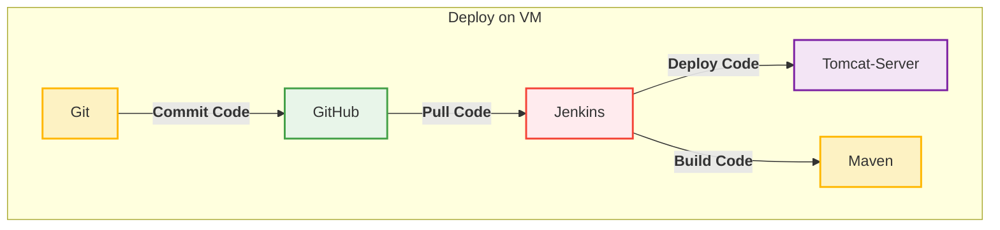
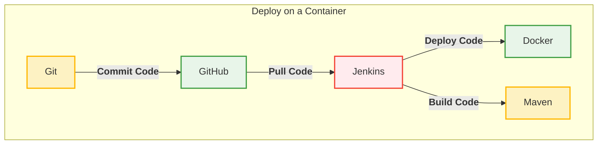
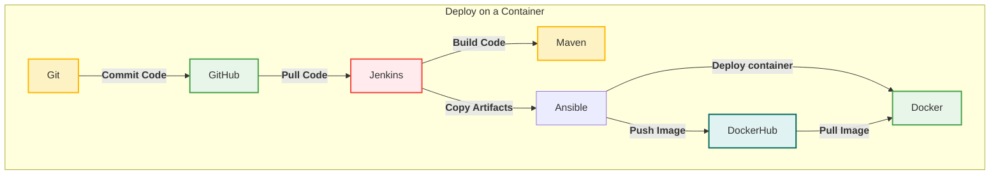
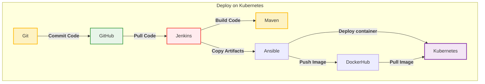

# DevOps-Project-1
---
## Workflow 

### 1- Deploy on VM (Web Server based on programming language used)
- Java

---

### 2- Deploy on a Container (Docker)

---

### 3- Deploy on a Container (Ansible, DockerHub, Docker)

---

### 4- Deploy on Kubernetes (Ansible, DockerHub, Kubernetes)

---
### Project 1 - Simple CI/CD Pipline 
- Tools: Git, GitHub, Jenkins, Maven, Docker, Kubernetes, Ansible
- Programming Language: Java
- Local/Cloud: Cloud -> AWS
- etc

---

### Project-Workflow 

#### Tools
- Git: Local Repo, commit code to GitHub
- GitHub: Distributed Repo
- Jenkins: Pull code from github, Automate CI -> contains Maven, Deploy code (VM,Docker) or Copy Artifacts (Ansible) 
- Maven: Build Code
- Ansible: Contarized the application (e.g. jar to Image) then Push Image to dockerhub, Deploy container to docker
- docker: pull image from dockerhub
- Kubernetes: Pull Image from dockerhub

#### Requirments 
- AWS Account
- Fork Project in Github
- MobaXterm program - for windows users only.
- Git Bash - check git is installed

#### Deployment (Different Here)
- Deploy on VM (Web Application based on programming language used)
- Deploy on a Container (Docker)
- Deploy on a Container (Ansible, DockerHub, Docker)
- Deploy on a Kubernetes (Ansible, DockerHub, Kubernetes)
---
